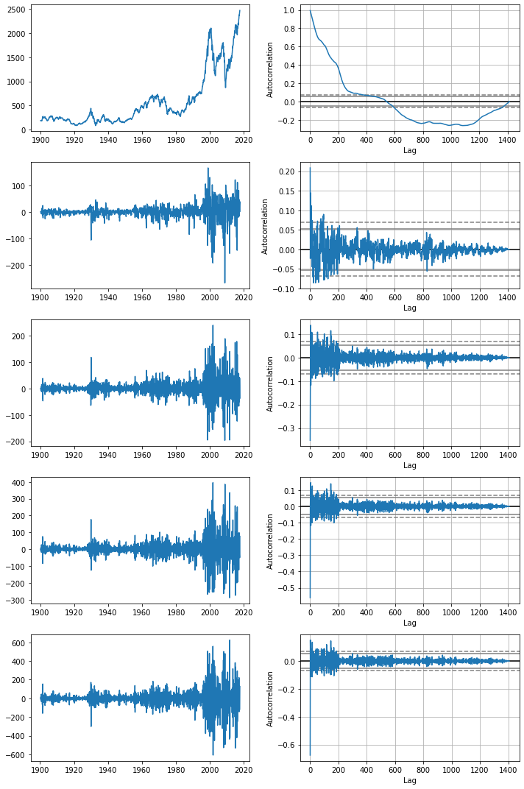
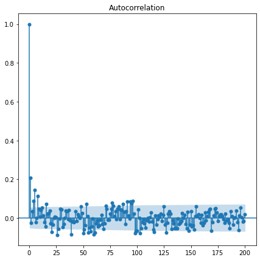
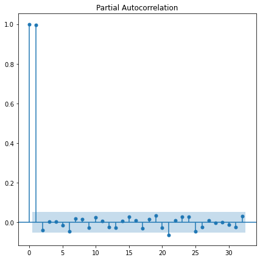

# Box-Jenkins Method on the S&P 500

Stuart Truax, 2022-06

This notebook demonstrates the use of the Box-Jenkins method for time series model identification and parameter estimation. The time series is the inflation-adjusted monthly S&P 500 index for the years 1900 to 2017.

This application of the Box-Jenkins method suggests that the times series is best modeled by an ARIMA(2,1,0) process. The process is nonstationary, with a autorgressive order of 2 in the differenced series, suggesting that monthly index level changes in the S&P 500 are most strongly dependent on the previous two months of index level changes (i.e. a quarter in the past).

The __Box-Jenkins method__ is composed of two primary tasks:

1. __Model identification__ and determination of the degree of __stationarity__ of the time series.
2. __Parameter estimation__ for the identified model.

A more detailed outline of the method can be given as follows:

1. __Model Indentification__
    * Determine the degreee of __stationarity__ of the time series by calculating its __autocorrelation function (ACF)__. The behavior of the autocorrelation function indicates the type of time series model to be used.

    | ACF Behavior| Model Indication |
    | ------------ | ---------------- |
    | Exponential decay| Autoregressive (AR) model|
    | Multiple impulses, otherwise zero   | Moving average (MA) model        |
    | Decay after a few lags | Autoregressive moving average (ARMA) model|
    | All zero or near zero | Random walk |
    | Periodic | Posseses seasonal components (e.g. GARCH model) |
    | No decay or very slow decay| Non-stationary process |

    * Many  ofthe possible models can be generalized as __autoregressive integrated moving average model (ARIMA)__ models, which are of the form:

$$ \left( 1- \sum^{p}\_{i=1} \phi\_{i} L^{i} \right) (1-L)^{d} X_t  = \left( 1 + \sum^{q}\_{i=1} \theta\_{i} L^{i} \right)\epsilon_t $$

* Here, $L$ is the __lag__ operator. The shorthand for an ARIMA model is __ARIMA(p,d,q)__, where $p$ is the order of the autorgressive terms, $q$ is the order of the moving average terms, and $d$ is the order of integration (i.e. the number of times the time series has to be differenced to obtain an ARMA model).
* Differencing the time series (i.e. adjusting $d$>0) is a method for removing non-stationary terms in the time series.

* If the ACF indicates an ARIMA(p,d,q) model, determination of the orders of the autoregressive and moving average terms (p and q, respectively) can be determined through the use of the __partial autocorrelation function (PACF)__. The method for this determination follows:

| Indicated Model| ACF Behavior on Differenced Data | PACF Behavior on Differenced Data |
| ------------ | ---------------- |  ---------------- |
| ARIMA(p,d,0) |   Decaying exponential or sinusoidal | PACF shows impulse at lag $p$, but none beyond |
| ARIMA(0,d,q) | ACF shows impulse at lag $q$, but none beyond|   Decaying exponential or sinusoidal |

2. __Parameter Estimation__

    * Determine the model coefficients $\phi_i$ (autoregressive coefficients) and $\theta_i$ (moving average coefficents).
    * For this task, algorithmic techniques are typically employed, including:

        * Maximum likelihood estimation (most common)
        * Nonlinear least squares regression

## Visualizations from the Analyses

### Index Series Data at Different Levels of Differencing and Corresponding Autocorrelation Functions

### Autocorrelation Function of the Differenced Series

### Partial Autocorrelation Function of the Differenced Series

